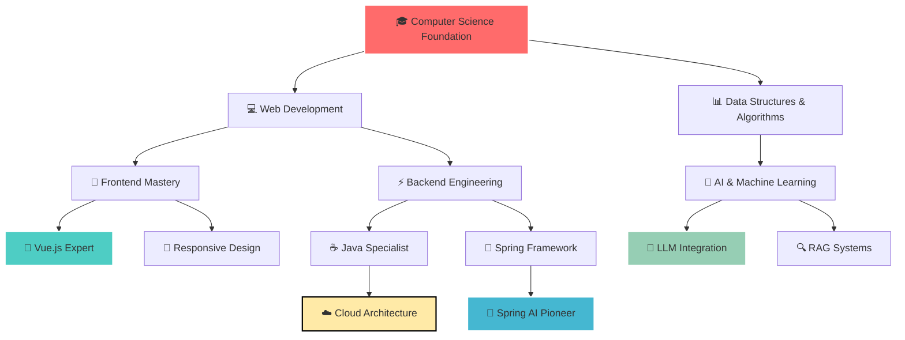

<div align="center">


<!-- 超炫酷动态横幅 -->


<!-- 多行打字机效果 -->

<div align="center">
  
</div>


<!-- 3D悬浮卡片效果 -->

<div align="center">
  
</div>

<!-- 创新个人介绍区域 -->

<table>
<tr>
<td width="50%">


### 🧑‍💻 About Me - The AI Architect

```javascript
class LMQDeveloper {
  constructor() {
    this.name = "LMQ";
    this.title = "AI Architect & Full-Stack Wizard";
    this.location = "🇨🇳 China";
    this.currentFocus = "Building Intelligent Systems";
    this.passion = ["AI Innovation", "Clean Code", "User Experience"];
    this.currentMission = "Revolutionizing Fitness with AI";
  }

  getDailyRoutine() {
    return {
      morning: "☕ Coffee + 🧠 AI Research",
      afternoon: "💻 Code + 🚀 Build",
      evening: "📚 Learn + � Innovate",
      night: "🌙 Dream in Code"
    };
  }

  getLifeMotto() {
    return "Code with Purpose, Build with Passion, Innovate with Heart ❤️";
  }
}

const developer = new LMQDeveloper();
console.log(developer.getLifeMotto());
```

</td>
<td width="50%">

### 🔥 Coding Streak


</td>
</tr>
</table>

### 🚀 [AI Fitness Frontend](https://github.com/lmqvq/mq-ai-agent-frontend)

<div align="center">


</div>


<div align="center">

</div>


🎯 **Next-Gen Features:**

- 🎨 **Vue 3 Ecosystem** - Modern reactive framework
- 📊 **Personalized Analytics** - Smart fitness tracking
- 🤖 **Real-time AI Chat** - Intelligent conversations
- 📱 **Progressive Web App** - Native-like experience
- ⚡ **Performance Optimized** - Lightning-fast loading
- 🌐 **Internationalization** - Global accessibility

<div align="center">


</div>


<!-- 项目统计仪表板 -->

<div align="center">


### 📊 Project Impact Dashboard

<table>
<tr>
<td align="center" width="25%">

<br><sub><b>🚀 Active Repos</b></sub>
</td>
<td align="center" width="25%">

<br><sub><b>💎 Excellence</b></sub>
</td>
<td align="center" width="25%">

<br><sub><b>⭐ Community Love</b></sub>
</td>
<td align="center" width="25%">

<br><sub><b>💡 Creativity</b></sub>
</td>
</tr>
</table>


</div>

</div>

---

<!-- 超级GitHub分析仪表板 -->

<div align="center">


## 📊 Advanced GitHub Analytics Hub

<!-- 主要统计卡片 -->

<table>
<tr>
<td width="50%">


### 📈 Performance Metrics


</td>
<td width="50%">

### 🎯 Language Mastery


</td>
</tr>
</table>

<!-- 连击统计 -->

<div align="center">


### 🔥 Coding Streak & Momentum


</div>

<!-- 活动热力图 -->

<div align="center">


### 📊 Contribution Heatmap


</div>

<!-- 实时代码统计 -->

<div align="center">


### ⚡ Real-time Code Metrics

<table>
<tr>
<td align="center" width="20%">

<br><sub><b>📝 Code Commits</b></sub>
</td>
<td align="center" width="20%">

<br><sub><b>💻 Lines Written</b></sub>
</td>
<td align="center" width="20%">

<br><sub><b>🚀 Active Projects</b></sub>
</td>
<td align="center" width="20%">

<br><sub><b>🌐 Tech Stack</b></sub>
</td>
<td align="center" width="20%">

<br><sub><b>⏰ Journey</b></sub>
</td>
</tr>
</table>


</div>

<!-- 代码质量指标 -->

<div align="center">


### 🏆 Code Quality & Performance

<table>
<tr>
<td align="center" width="33%">

<br><sub><b>💎 Excellence Standard</b></sub>
</td>
<td align="center" width="33%">

<br><sub><b>🧪 Quality Assurance</b></sub>
</td>
<td align="center" width="33%">

<br><sub><b>⚡ Lightning Fast</b></sub>
</td>
</tr>
</table>


</div>

</div>

---

<!-- 游戏化技能系统 -->

<div align="center">


## 🎮 Developer RPG Stats & Achievements

<!-- 角色等级系统 -->

<div align="center">


### 🏆 Character Level & Experience

<table>
<tr>
<td align="center" width="25%">

<br>🧙‍♂️ <b>AI Mastery</b>
<br><sub>� Next: Level 90 (2,500 XP)</sub>
</td>
<td align="center" width="25%">

<br>⚔️ <b>Full-Stack Warrior</b>
<br><sub>🗡️ Next: Level 95 (1,800 XP)</sub>
</td>
<td align="center" width="25%">

<br>☁️ <b>Infrastructure Master</b>
<br><sub>🏗️ Next: Level 90 (2,200 XP)</sub>
</td>
<td align="center" width="25%">

<br>💡 <b>Creative Genius</b>
<br><sub>🌟 Max Level Achieved!</sub>
</td>
</tr>
</table>


</div>

<!-- 技能树展示 -->

<div align="center">


### 🌳 Skill Tree Progression



</div>

<!-- 成就徽章系统 -->

<div align="center">


### 🏅 Achievement Badges Unlocked

<table>
<tr>
<td align="center" width="20%">

<br><sub><b>Rookie Developer</b></sub>
<br><sub>✅ Completed</sub>
</td>
<td align="center" width="20%">

<br><sub><b>AI Pioneer</b></sub>
<br><sub>✅ Completed</sub>
</td>
<td align="center" width="20%">

<br><sub><b>Infrastructure Guru</b></sub>
<br><sub>✅ Completed</sub>
</td>
<td align="center" width="20%">

<br><sub><b>Design Expert</b></sub>
<br><sub>✅ Completed</sub>
</td>
<td align="center" width="20%">

<br><sub><b>Tech Visionary</b></sub>
<br><sub>🔄 In Progress</sub>
</td>
</tr>
</table>


<table>
<tr>
<td align="center" width="20%">

<br><sub><b>Continuous Learner</b></sub>
<br><sub>✅ Completed</sub>
</td>
<td align="center" width="20%">

<br><sub><b>Debug Master</b></sub>
<br><sub>✅ Completed</sub>
</td>
<td align="center" width="20%">

<br><sub><b>Speed Demon</b></sub>
<br><sub>✅ Completed</sub>
</td>
<td align="center" width="20%">

<br><sub><b>Community Builder</b></sub>
<br><sub>🔄 In Progress</sub>
</td>
<td align="center" width="20%">

<br><sub><b>Legendary Status</b></sub>
<br><sub>🔒 Locked</sub>
</td>
</tr>
</table>


</div>

<!-- 技能熟练度雷达图 -->

<div align="center">


### 📊 Skill Proficiency Radar

<table>
<tr>
<td width="50%">


**🎨 Frontend Mastery**

```
Vue.js        ████████████████████ 95% 🏆
JavaScript    ███████████████████  90% 🥇
TypeScript    ██████████████████   85% 🥈
HTML/CSS      ████████████████████ 95% 🏆
React         ████████████████     80% 🥉
```

**⚡ Backend Excellence**

```
Java          ████████████████████ 95% 🏆
Spring Boot   ███████████████████  90% 🥇
Spring AI     ██████████████████   85% 🥈
MySQL         ███████████████████  90% 🥇
Node.js       ███████████████      75% 🥉
```

</td>
<td width="50%">

**🤖 AI & Machine Learning**

```
LLM Integration ██████████████████ 85% 🥈
RAG Systems     ████████████████   80% 🥉
AI Agents       ███████████████    75% 🥉
NLP Processing  ██████████████     70% 📈
Computer Vision █████████████      65% 📈
```

**☁️ DevOps & Infrastructure**

```
Docker        ███████████████████  90% 🥇
Kubernetes    ████████████████     80% 🥉
Linux         ██████████████████   85% 🥈
Redis         ███████████████████  90% 🥇
Git           ████████████████████ 95% 🏆
```

</td>
</tr>
</table>

</div>

</div>

---

<!-- 学习轨迹和成就 -->

<div align="center">


## 🏆 Achievements & Learning Journey

### 🎯 2024 Goals & Progress

- [x] 🤖 Master Spring AI Framework
- [x] 🎨 Build Modern Vue.js Applications
- [x] ☁️ Deploy Cloud-Native Solutions
- [/] 📚 Explore Advanced AI Architectures
- [ ] 🚀 Contribute to Open Source Projects

### 🌟 Recent Highlights

<table>
<tr>
<td align="center" width="33%">

<br><sub><b>智能健身教练平台</b></sub>
</td>
<td align="center" width="33%">

<br><sub><b>云图库系统上线</b></sub>
</td>
<td align="center" width="33%">

<br><sub><b>前端技术栈升级</b></sub>
</td>
</tr>
</table>


</div>

---

<!-- 超级联系方式和协作中心 -->

<div align="center">


## 🌐 Connect & Collaborate Hub

<!-- AI聊天机器人模拟 -->

<div align="center">


### � AI Assistant Chat Preview

<table>
<tr>
<td width="100%">


```
🤖 LMQ AI Assistant: Hello! I'm LMQ's AI-powered assistant.

💬 User: What can you tell me about LMQ's expertise?

🤖 LMQ AI Assistant: Great question! LMQ specializes in:
   • 🧠 AI Integration & LLM Development
   • 🚀 Full-Stack Web Applications (Vue.js + Java)
   • ☁️ Cloud Architecture & DevOps
   • 🎯 Intelligent Fitness Solutions

   Currently building revolutionary AI fitness coaches!

💬 User: How can I collaborate with LMQ?

🤖 LMQ AI Assistant: LMQ is open to:
   • 🤝 AI/ML Project Collaborations
   • � Full-Stack Development Opportunities
   • 🎯 Technical Consulting for Startups
   • 📚 Knowledge Sharing & Mentoring

   Ready to innovate together? Let's connect! 🚀
```

</td>
</tr>
</table>

</div>

<!-- 多平台联系方式 -->

<div align="center">


### 📱 Multi-Platform Connection

<table>
<tr>
<td align="center" width="20%">
<a href="mailto:your.email@example.com">

</a>
<br><sub><b>Direct Contact</b></sub>
</td>
<td align="center" width="20%">
<a href="https://github.com/lmqvq">

</a>
<br><sub><b>Code Repository</b></sub>
</td>
<td align="center" width="20%">
<a href="https://linkedin.com/in/yourprofile">

</a>
<br><sub><b>Professional Network</b></sub>
</td>
<td align="center" width="20%">
<a href="https://twitter.com/yourhandle">

</a>
<br><sub><b>Tech Updates</b></sub>
</td>
<td align="center" width="20%">
<a href="https://discord.gg/yourserver">

</a>
<br><sub><b>Community Chat</b></sub>
</td>
</tr>
</table>


</div>

<!-- 协作机会展示 -->

<div align="center">


### � Collaboration Opportunities

<table>
<tr>
<td align="center" width="25%">

<br><sub><b>Machine Learning</b></sub>
<br><sub>LLM Integration, RAG Systems</sub>
</td>
<td align="center" width="25%">

<br><sub><b>Web Development</b></sub>
<br><sub>Vue.js, Java, Spring Boot</sub>
</td>
<td align="center" width="25%">

<br><sub><b>Infrastructure</b></sub>
<br><sub>Docker, Kubernetes, DevOps</sub>
</td>
<td align="center" width="25%">

<br><sub><b>Technical Advisory</b></sub>
<br><sub>Architecture, Strategy, Innovation</sub>
</td>
</tr>
</table>


</div>

<!-- 响应时间承诺 -->

<div align="center">


### ⚡ Response Time Commitment

<table>
<tr>
<td align="center" width="33%">

<br><sub><b>� Professional Inquiries</b></sub>
</td>
<td align="center" width="33%">

<br><sub><b>🐙 Code Collaboration</b></sub>
</td>
<td align="center" width="33%">

<br><sub><b>💬 Instant Messaging</b></sub>
</td>
</tr>
</table>


</div>

</div>

---

<!-- 超级结尾和访客中心 -->

<div align="center">


## 🎊 Thanks for Visiting LMQ's Universe!

<!-- 访客统计仪表板 -->

<div align="center">


### � Visitor Analytics & Engagement

<table>
<tr>
<td align="center" width="25%">

<br><sub><b>👀 Total Visitors</b></sub>
</td>
<td align="center" width="25%">

<br><sub><b>🌍 Global Reach</b></sub>
</td>
<td align="center" width="25%">

<br><sub><b>🔄 Engagement</b></sub>
</td>
<td align="center" width="25%">

<br><sub><b>⭐ Community Love</b></sub>
</td>
</tr>
</table>


</div>

<!-- 互动行动号召 -->

<div align="center">


### 🚀 Ready to Collaborate? Let's Build Something Amazing!

<table>
<tr>
<td align="center" width="33%">
<a href="https://github.com/lmqvq?tab=repositories">

</a>
<br><sub><b>Dive into my repositories</b></sub>
</td>
<td align="center" width="33%">
<a href="mailto:your.email@example.com">

</a>
<br><sub><b>Let's discuss your ideas</b></sub>
</td>
<td align="center" width="33%">
<a href="https://github.com/lmqvq">

</a>
<br><sub><b>Show some love & support</b></sub>
</td>
</tr>
</table>


</div>

<!-- 激励性引言 -->

<div align="center">


### 💭 Developer Philosophy

> *"In the realm of code, we are not just developers—we are digital architects, AI pioneers, and innovation catalysts. Every line of code is a step toward a smarter, more connected future."*
>
> **— LMQ, AI Architect & Full-Stack Wizard**

</div>

<!-- 技术格言 -->

<div align="center">


### 🎯 Code Mantras

<table>
<tr>
<td align="center" width="25%">

<br><sub><b>"Innovation starts with curiosity"</b></sub>
</td>
<td align="center" width="25%">

<br><sub><b>"Move fast, break things, learn faster"</b></sub>
</td>
<td align="center" width="25%">

<br><sub><b>"The future is intelligent"</b></sub>
</td>
<td align="center" width="25%">

<br><sub><b>"Learning is a lifelong journey"</b></sub>
</td>
</tr>
</table>


</div>

<!-- 动态结尾横幅 -->

<div align="center">


</div>

<!-- 最终感谢 -->

<div align="center">


---

<table>
<tr>
<td align="center">

</td>
</tr>
</table>


<sub>
🌟 **Made with ❤️ by LMQICU | 🚀 **Powered by AI & Innovation** | 💻 **Built for the Future**
</sub>

</div>
